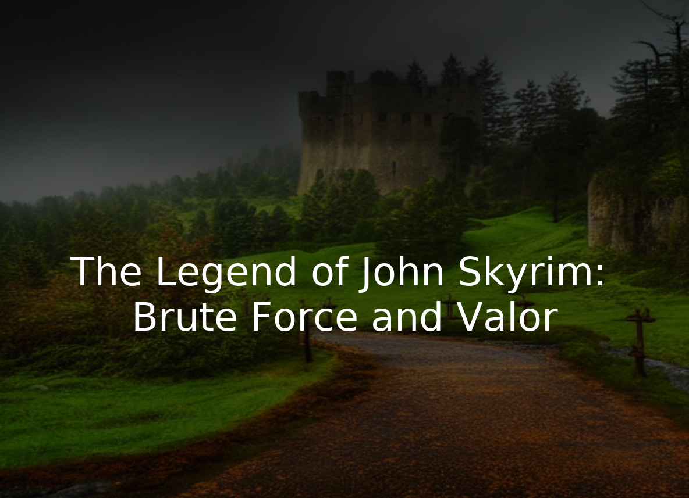
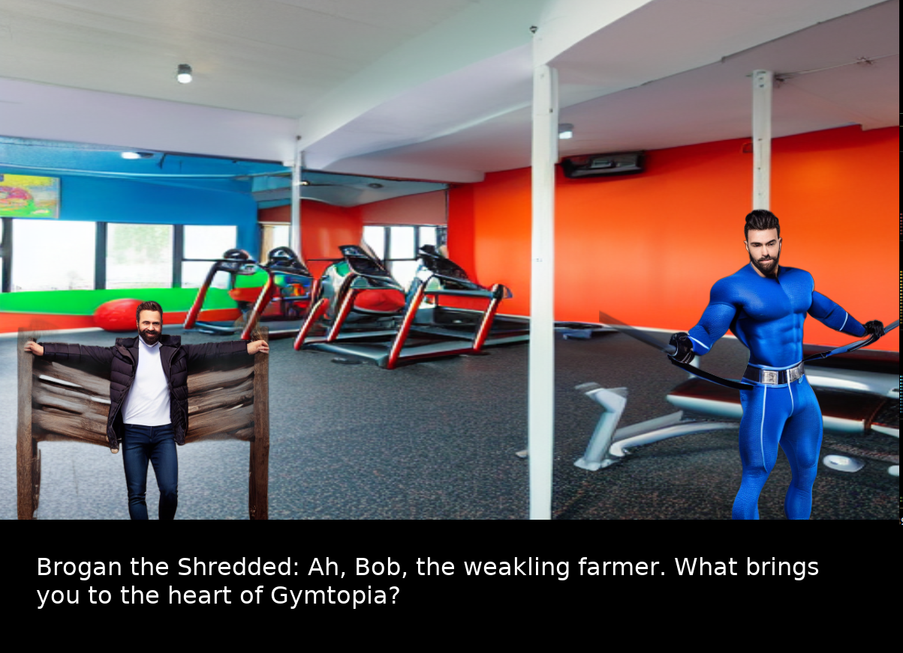
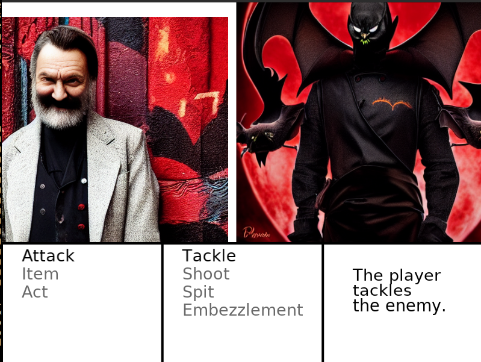
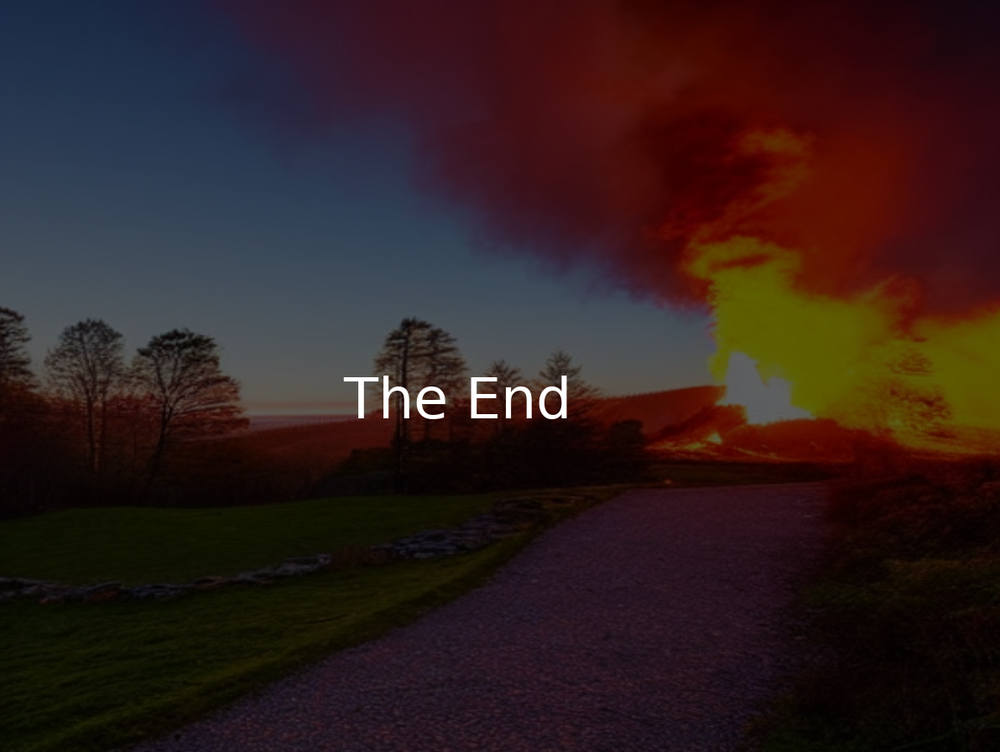

# Game Jam Generative AI Role-Playing Game

For the code that was run during the showcase, please see the `src` folder on this branch: https://github.com/bblakeslee-maker/game-gen/tree/dharton/showcase/src

## Demo Images

Below are a sample of demo images the game generated.  Note that they are from multiple runs of the system with different user prompts.

All text was generated via ChatGPT.  All backgrounds and characters were generated by Stable Diffusion 1.5.

### Title Screen

### Dialog Screen

### Combat Screen

### End Screen

